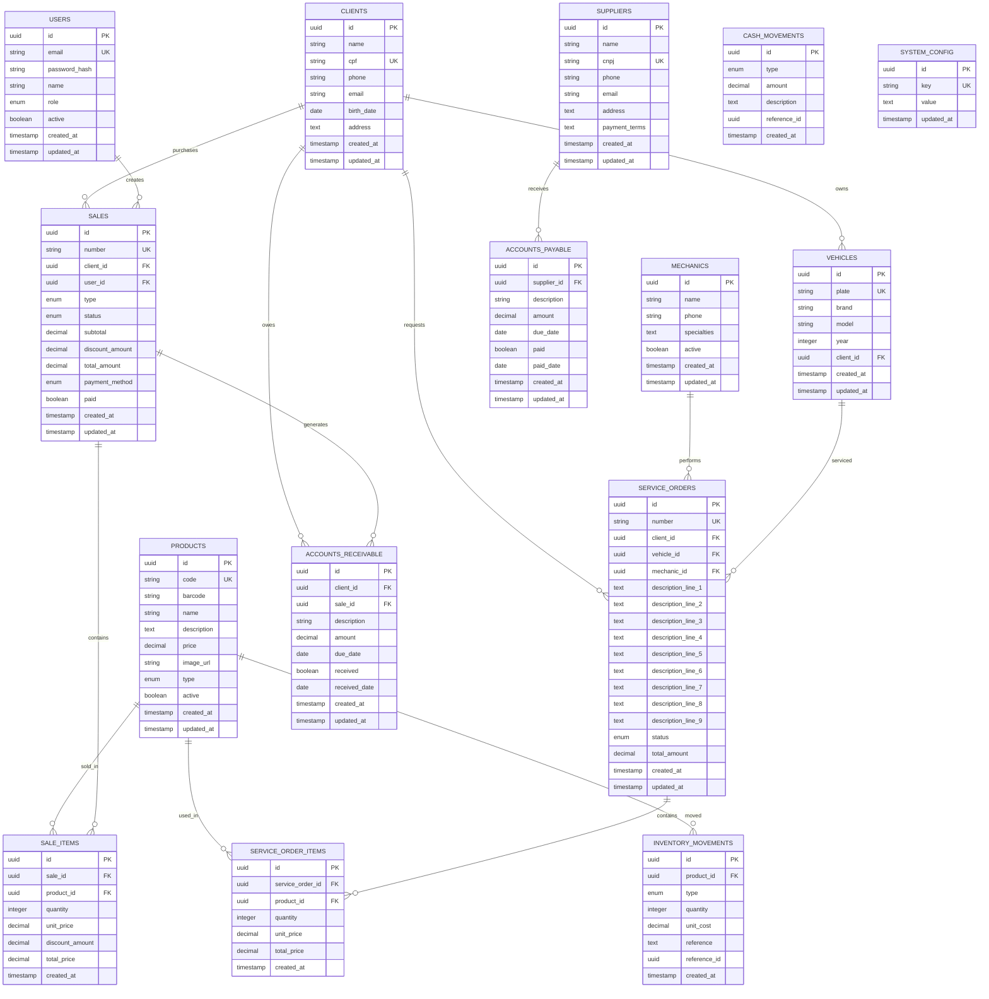

# Documento de Design - Sistema de Gestão de Oficina Mecânica de Motos

## Visão Geral

O Sistema de Gestão de Oficina Mecânica de Motos é uma aplicação web full-stack que centraliza todas as operações de uma oficina de motos. A arquitetura segue o padrão MVC com separação clara entre frontend (React), backend (Node.js/Express) e banco de dados (PostgreSQL).

### Objetivos do Design
- **Escalabilidade**: Suportar crescimento do negócio sem degradação de performance
- **Usabilidade**: Interface intuitiva para usuários com diferentes níveis técnicos
- **Confiabilidade**: Sistema robusto com backup automático e recuperação de dados
- **Segurança**: Proteção de dados sensíveis e controle de acesso granular
- **Performance**: Resposta rápida mesmo com grande volume de dados

## Arquitetura

### Arquitetura Geral


### Padrões Arquiteturais
- **Frontend**: Component-based architecture com React
- **Backend**: Layered architecture (Controller → Service → Repository)
- **Database**: Relational model com foreign keys e constraints
- **API**: RESTful design com endpoints semânticos
- **Authentication**: JWT-based com refresh tokens

## Componentes e Interfaces

### Frontend Components

#### Core Components
```typescript
// Layout Components
- AppLayout: Layout principal com navegação
- Sidebar: Menu lateral com módulos
- Header: Cabeçalho com informações do usuário
- Footer: Rodapé com informações da oficina

// Feature Components
- ClientManager: Gestão de clientes
- ServiceOrderManager: Gestão de OS
- SalesManager: Sistema de vendas
- InventoryManager: Controle de estoque
- FinancialManager: Gestão financeira
- ReportsManager: Sistema de relatórios

// Shared Components
- DataTable: Tabela reutilizável com filtros
- FormBuilder: Construtor de formulários dinâmicos
- Modal: Componente de modal reutilizável
- DatePicker: Seletor de datas
- BarcodeScanner: Leitor de código de barras
- PrintPreview: Visualização de impressão
```

#### State Management
```typescript
// Redux Store Structure
interface AppState {
  auth: AuthState;
  clients: ClientsState;
  serviceOrders: ServiceOrdersState;
  sales: SalesState;
  inventory: InventoryState;
  financial: FinancialState;
  ui: UIState;
}
```

### Backend API Structure

#### Controllers
```typescript
// Controllers seguem padrão REST
- AuthController: /api/auth/*
- ClientsController: /api/clients/*
- ServiceOrdersController: /api/service-orders/*
- SalesController: /api/sales/*
- ProductsController: /api/products/*
- InventoryController: /api/inventory/*
- FinancialController: /api/financial/*
- ReportsController: /api/reports/*
- ConfigController: /api/config/*
```

#### Services Layer
```typescript
// Business Logic Layer
- AuthService: Autenticação e autorização
- ClientService: Lógica de negócio para clientes
- ServiceOrderService: Processamento de OS
- SalesService: Processamento de vendas
- InventoryService: Controle de estoque
- FinancialService: Cálculos financeiros
- ReportService: Geração de relatórios
- NotificationService: Envio de notificações
```

#### Repository Layer
```typescript
// Data Access Layer
- BaseRepository: Operações CRUD genéricas
- ClientRepository: Acesso a dados de clientes
- ServiceOrderRepository: Acesso a dados de OS
- SalesRepository: Acesso a dados de vendas
- ProductRepository: Acesso a dados de produtos
- InventoryRepository: Acesso a dados de estoque
- FinancialRepository: Acesso a dados financeiros
```

## Modelos de Dados

### Diagrama de Entidade-Relacionamento


### Principais Entidades

#### Users (Usuários do Sistema)
```sql
CREATE TABLE users (
    id UUID PRIMARY KEY DEFAULT gen_random_uuid(),
    email VARCHAR(255) UNIQUE NOT NULL,
    password_hash VARCHAR(255) NOT NULL,
    name VARCHAR(255) NOT NULL,
    role user_role NOT NULL DEFAULT 'operator',
    active BOOLEAN DEFAULT true,
    created_at TIMESTAMP DEFAULT NOW(),
    updated_at TIMESTAMP DEFAULT NOW()
);

CREATE TYPE user_role AS ENUM ('admin', 'manager', 'operator', 'mechanic');
```

#### Clients (Clientes)
```sql
CREATE TABLE clients (
    id UUID PRIMARY KEY DEFAULT gen_random_uuid(),
    name VARCHAR(255) NOT NULL,
    cpf VARCHAR(14) UNIQUE,
    phone VARCHAR(20),
    email VARCHAR(255),
    birth_date DATE,
    address TEXT,
    created_at TIMESTAMP DEFAULT NOW(),
    updated_at TIMESTAMP DEFAULT NOW()
);
```

#### Service Orders (Ordens de Serviço)
```sql
CREATE TABLE service_orders (
    id UUID PRIMARY KEY DEFAULT gen_random_uuid(),
    number VARCHAR(20) UNIQUE NOT NULL,
    client_id UUID REFERENCES clients(id),
    vehicle_id UUID REFERENCES vehicles(id),
    mechanic_id UUID REFERENCES mechanics(id),
    description_line_1 TEXT,
    description_line_2 TEXT,
    description_line_3 TEXT,
    description_line_4 TEXT,
    description_line_5 TEXT,
    description_line_6 TEXT,
    description_line_7 TEXT,
    description_line_8 TEXT,
    description_line_9 TEXT,
    status service_order_status DEFAULT 'pending',
    total_amount DECIMAL(10,2) DEFAULT 0,
    created_at TIMESTAMP DEFAULT NOW(),
    updated_at TIMESTAMP DEFAULT NOW()
);

CREATE TYPE service_order_status AS ENUM ('pending', 'in_progress', 'waiting_parts', 'completed', 'delivered', 'cancelled');
```

## Tratamento de Erros

### Estratégia de Error Handling

#### Frontend Error Handling
```typescript
// Error Boundary para capturar erros React
class ErrorBoundary extends React.Component {
  // Captura erros de componentes filhos
}

// Interceptor Axios para erros de API
axios.interceptors.response.use(
  response => response,
  error => {
    // Log de erros
    // Notificação ao usuário
    // Redirecionamento se necessário
  }
);
```

#### Backend Error Handling
```typescript
// Middleware global de tratamento de erros
const errorHandler = (err, req, res, next) => {
  // Log do erro
  logger.error(err);
  
  // Resposta padronizada
  res.status(err.status || 500).json({
    error: {
      message: err.message,
      code: err.code,
      timestamp: new Date().toISOString()
    }
  });
};
```

#### Database Error Handling
```sql
-- Constraints para integridade de dados
ALTER TABLE service_orders 
ADD CONSTRAINT check_total_amount_positive 
CHECK (total_amount >= 0);

-- Triggers para auditoria
CREATE OR REPLACE FUNCTION update_updated_at_column()
RETURNS TRIGGER AS $$
BEGIN
    NEW.updated_at = NOW();
    RETURN NEW;
END;
$$ language 'plpgsql';
```

### Tipos de Erro
- **ValidationError**: Dados inválidos
- **AuthenticationError**: Falha na autenticação
- **AuthorizationError**: Acesso negado
- **NotFoundError**: Recurso não encontrado
- **ConflictError**: Conflito de dados
- **DatabaseError**: Erro de banco de dados
- **ExternalServiceError**: Erro em serviços externos

## Estratégia de Testes

### Pirâmide de Testes

#### Testes Unitários (70%)
```typescript
// Frontend - Jest + React Testing Library
describe('ClientForm', () => {
  it('should validate required fields', () => {
    // Test implementation
  });
});

// Backend - Jest + Supertest
describe('ClientService', () => {
  it('should create client with valid data', () => {
    // Test implementation
  });
});
```

#### Testes de Integração (20%)
```typescript
// API Integration Tests
describe('Client API', () => {
  it('should create and retrieve client', async () => {
    // Test full API flow
  });
});

// Database Integration Tests
describe('Client Repository', () => {
  it('should persist client data correctly', async () => {
    // Test database operations
  });
});
```

#### Testes End-to-End (10%)
```typescript
// Cypress E2E Tests
describe('Service Order Flow', () => {
  it('should complete full service order process', () => {
    // Test complete user journey
  });
});
```

### Estratégias de Teste
- **Test-Driven Development (TDD)**: Para lógica de negócio crítica
- **Behavior-Driven Development (BDD)**: Para fluxos de usuário
- **Continuous Integration**: Testes automáticos em cada commit
- **Test Coverage**: Mínimo de 80% de cobertura de código

## Considerações de Performance

### Frontend Performance
- **Code Splitting**: Carregamento lazy de rotas
- **Memoization**: React.memo e useMemo para componentes pesados
- **Virtual Scrolling**: Para listas grandes
- **Image Optimization**: Lazy loading e compressão
- **Bundle Optimization**: Tree shaking e minificação

### Backend Performance
- **Database Indexing**: Índices em colunas frequentemente consultadas
- **Query Optimization**: Uso de EXPLAIN ANALYZE
- **Caching**: Redis para dados frequentemente acessados
- **Connection Pooling**: Pool de conexões com banco
- **Rate Limiting**: Proteção contra abuso de API

### Database Performance
```sql
-- Índices estratégicos
CREATE INDEX idx_clients_cpf ON clients(cpf);
CREATE INDEX idx_service_orders_status ON service_orders(status);
CREATE INDEX idx_sales_created_at ON sales(created_at);
CREATE INDEX idx_inventory_movements_product_id ON inventory_movements(product_id);

-- Particionamento para tabelas grandes
CREATE TABLE inventory_movements_2024 PARTITION OF inventory_movements
FOR VALUES FROM ('2024-01-01') TO ('2025-01-01');
```

## Considerações de Segurança

### Autenticação e Autorização
- **JWT Tokens**: Access tokens com expiração curta
- **Refresh Tokens**: Para renovação automática
- **Role-Based Access Control (RBAC)**: Controle granular de permissões
- **Password Hashing**: bcrypt com salt rounds adequados

### Proteção de Dados
- **HTTPS**: Comunicação criptografada
- **Input Validation**: Sanitização de dados de entrada
- **SQL Injection Prevention**: Uso de prepared statements
- **XSS Prevention**: Sanitização de output
- **CSRF Protection**: Tokens CSRF em formulários

### Auditoria e Monitoramento
```sql
-- Tabela de auditoria
CREATE TABLE audit_log (
    id UUID PRIMARY KEY DEFAULT gen_random_uuid(),
    table_name VARCHAR(50) NOT NULL,
    operation VARCHAR(10) NOT NULL,
    old_values JSONB,
    new_values JSONB,
    user_id UUID REFERENCES users(id),
    timestamp TIMESTAMP DEFAULT NOW()
);
```

## Integração com Serviços Externos

### Armazenamento de Imagens
```typescript
// Cloudinary Integration
const cloudinary = require('cloudinary').v2;

const uploadImage = async (file) => {
  return await cloudinary.uploader.upload(file.path, {
    folder: 'oficina-motos',
    transformation: [
      { width: 800, height: 600, crop: 'limit' },
      { quality: 'auto' }
    ]
  });
};
```

### Sistema de Impressão
```typescript
// Printer Integration
const printDocument = async (documentType, data) => {
  const template = await getTemplate(documentType);
  const pdf = await generatePDF(template, data);
  
  // Send to printer based on type
  switch (documentType) {
    case 'service_order':
      return await printLaser(pdf);
    case 'receipt':
      return await printMatrix(pdf);
    default:
      throw new Error('Unknown document type');
  }
};
```

### Serviço de Email
```typescript
// Email Service Integration
const sendEmail = async (to, template, data) => {
  const emailContent = await renderTemplate(template, data);
  
  return await emailService.send({
    to,
    subject: emailContent.subject,
    html: emailContent.html,
    attachments: emailContent.attachments
  });
};
```